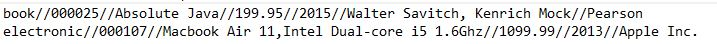
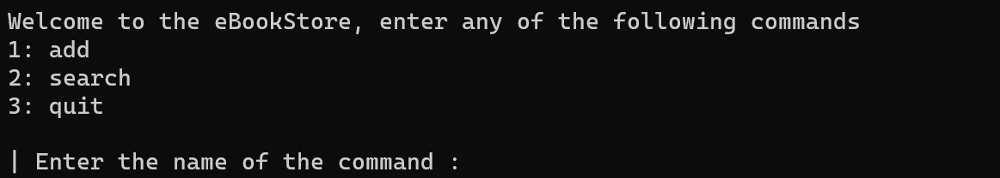
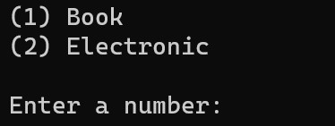

version 1.1.0

# Purpose 

The main purpose of this project is to allow the users to enter information about either an Electronic or Book and store the details that were entered in a mock data base or text file. The user is when also able to search for the products through the various filters provided below. 

# Implemented Technologies 

This is an application that uses `Gradle 6.6.1`, along with its associated JUnit tests with the default settings for the gradle application. `JDK 11` was used at the time of this application, resources availible at their official websites. 

# Features and Usage  

### Compilation and Files

The program can initially be compiled by using Gradle since the application is actually following the gradle file structure

- `.gradle run --args <filename.txt>`
- Default file includes `inputfile.txt` includes testable objects 

File name here will be meant for actually storing details of the products and **loading previously stored details** which can be the default that's been provided or user inputted. **This file will also store all the additional information at the end**. 

### Entering information

The file has the following format for various entries when reading and also when writing them back out : 

Upon running the user will be greeted by the following : 
Where they may add a product, search for one or quit the program

if user proceeds to add then :
They may add a book or electronic which will ask for different information depending on that. 

if the user proceeds to search, they will be prompted with similar parameters where they will be allowed to search with 

# Full Documentation and Test Plan 

### App.java

Within this file we are asking the user for input for the various objects that we have, with different fields correlating to each of the book class and the electronics class. Once the objects have been populated the user is allowed to search including the different fields which are interpreted within the EStoreSearch class.

### Book.java

Within this file we are essentially initializing the book object with the values that the user inputted from the previous App.java program. The Book fields include; product ID, description, price, year, author and publisher

### Electronics.java

Within this file we are initializing the electronics object with the values that the user has inputted from the previous App.java program however this time for electronics rather than books. The electronics fields include ; product ID, description, price, year, and the maker

### Products.java

Within the most recent addition this is the parent class ( or super class ) in the hierarchy of inheritance, where the book and electronic classes are both subclasses or child classes, where parent contains all of the common information between both of the books and electronics as a whole.

### EStoreSearch

This file has various functions that allow for the search through different fields. The user is able to search through matchings of; productID, description keywords , and they year ( years including previous, all after, specfic year and a range of years )

### Testing 

For user input where there needs to be mandatory fields; these fields are tested to make sure they aren't empty, and fall within certain ranges. Mandatory fields include the Product ID, year and description of the object. Ranges for product ID include a length of 6 only, price cannot be negative, year must be greater than 1000 and less than 9999. However, any non mandatory fields are able to be left blank. However, keeping in mind when the search command is used any of the searching options including ; productID, keywords and years can be left blank. Each of the cases 2^3 = 8, are accounted for within the eStoreSearch class for searching.

When dealing with the objects within various functions there are certain checks that we conduct to ensure that the values being passed into the object are sufficient and for example not null

Within EStoreSearch there are checks to make sure the list is not empty, and when comparing to take into account what lists are larger than the other for matching the key value pairs for an accurate search.

### As of version 1.1.0

User is able to provide a file which contains formatted records of various book and electronic objects, where this file is checked to make sure it exists in the appropriate path. FilenotFound exceptions is then checked to make sure the system handles the exception appropriatley within a try catch system as specified. While parsing this file, it is carefully examined to match the fields within either a book or electronic object and it is added into the products Array List accordingly ( File format is discussed farther below )

After the user completes entering each type of object there is branching, where depending on the type of object they create; either book or electronic, there will be a function which writes to the file. This function will throw an IOexception which is dealt with in the main ( tested in JUNIT ) and will append to the current file each time one of these objects is entered. ( FileName check remain similar to that of opening the file in the first place )

within EStoreSearch the new addition of the hashmap, means that when each of the keywords are mapped to their indexes there needs to be checks to make sure the same index is not added within the hashmap. This is because if the same keyword is found within the same object multiple times we want to map to this object once and this is accounted for.

When multiple sections of the search are involved such as the year, we need to account for the fact that there needs to be an intersection between the yearindex list and the hasmap for each of the keywords where each of the elements in the intersection cannot be repeated similar to the above. If this is accounted for then multiple objects that are the same will be printed

When the user is entering each of the book and electronic objects, the duplicate productID's are searched for as a linear scan from one list rather than from 2 individual lists

